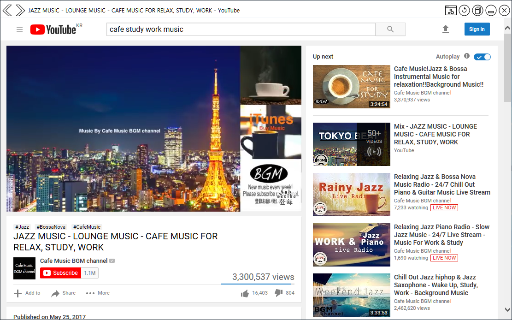

# YouTube Browser App



**[Download v1.0 Release](https://github.com/rkttu/YouTubeBrowserApp/releases/tag/1.0)**

This app is a separate app that only plays YouTube videos, regardless of the behavior of your web browser. It helps you to watch both your web browser and YouTube video at the same time.

This app is inspired by DeskApp for YouTube (https://itunes.apple.com/us/app/deskapp-for-youtube/id1180531112).

## What you need to run the program

* In Windows 8 or later, you can run it immediately without installing the program separately. (Windows 10 is recommended.)
* On Windows 7 and below, the .NET Framework 4.0 Client Profile is required. And Internet Explorer 11 is required.
* This app does not support offline mode, so you need to have an internet connection.

## How to use

Open this app, sign in to YouTube, and play your favorite music.

If you know the video ID, you can play the video quickly by typing the following command line:

```
youtube-app.exe <Your Video ID>
```

Also, if you minimize the window, the window will be displayed as a tray icon, so you can make the taskbar neat.

## Localization

Currently, this program supports `Korean (Korea)` and `English` as display languages. I welcome your participation in multilingual translation.

## License

This project follows the MIT license.
